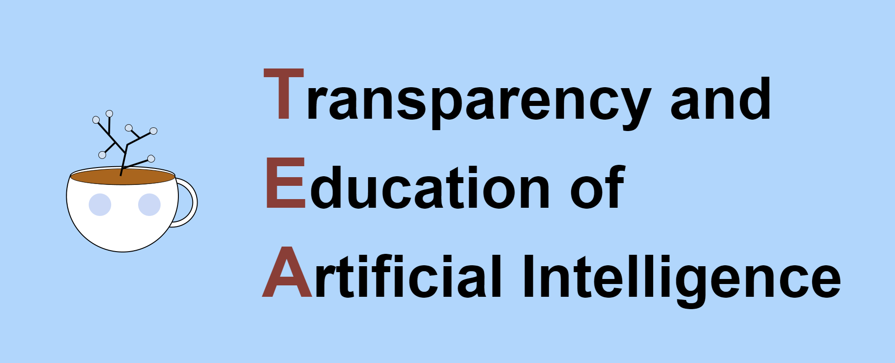

# TEA - Transparency and Education of Artificial Intelligence Web-App

## Overview
TEA is a webapp that is meant to help educate users on how AI/ML models are trained through an easy to understand and navigate web interface that allows the user to train their on model on a recidivism dataset. The user takes on the role of an ML developer that's creating a model for use in the United States Judicial System. Their model will be used in a real world, high impact situation, so hopefully by the end of the session they'll learn how to spot problematic feature choices and makes sure that their final model doesn't exhibit unfair biases on the character's created to test it.  

*Have fun and get educated on what goes into building a Machine Learning model with TEA!*
## Setup Instructions:
1. Clone the repository
2. Make sure you have [Python 3.9](https://www.python.org/downloads/release/python-390/) installed and you're running all commands from now on with version 3.9
3. In the root directory of the cloned repo, run the following commands  
    1. Remove any existing virtual environments:  
    `$ rm -rf env`  
    2. Create a virtual environment:   
    `$ python -m venv env`   
    3. Activate the virtual env and set correct Flask variables:  
        - (Linux/Mac):  
        `$ source env/bin/activate && export FLASK_APP=run.py && export FLASK_ENV=development && flask run`  
        - (Windows)  
        `$ source env/Scripts/activate && export FLASK_APP=run.py && export FLASK_ENV=development`  
    4. Upgrade pip:  
    `$ pip install --upgrade pip`
    5. Install all required python packages:  
    `$ pip install -r requirements.txt` 

## Run Instructions:  
1. Start up Python virtual environment:  
    - (Linux/Mac):  
    `$ source env/bin/activate`  
    - (Windows)  
    `$ source env/Scripts/activate`    
2. Run the application:  
`$ flask run`  
3. Open browser and navigate to **localhost:5000**

